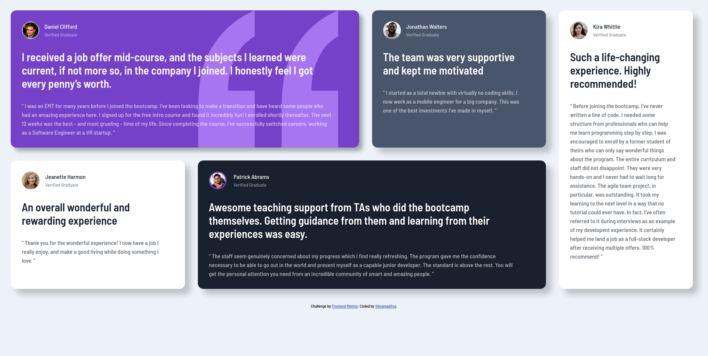

# Frontend Mentor - Testimonials grid section solution

This is a solution to the [Testimonials Grid Section Challenge on Frontend Mentor](https://www.frontendmentor.io/challenges/testimonials-grid-section-Nnw6J7Un7). Frontend Mentor challenges help you improve your coding skills by building realistic projects.

## Table of contents

- [Overview](#overview)
  - [The Challenge](#the-challenge)
  - [Screenshot](#screenshot)
  - [Links](#links)
- [My process](#my-process)
  - [Built With](#built-with)
  - [What I Learned](#what-i-learned)
  - [Continued Development](#continued-development)
  - [Useful Resources](#useful-resources)
- [Author](#author)
- [Acknowledgments](#acknowledgments)

## Overview

### The challenge

Users should be able to:

- View the optimal layout for the site depending on their device's screen size

### Screenshot

- Desktop Screenshot



- Mobile Screenshot


### Links

- Solution URL: [Testimonial-Grid-Section](https://testimonial-grid-section-fem.netlify.app/)

## My process

### Built with

- Semantic HTML5 Markup
- CSS Custom Properties
- CSS Variables
- Flexbox
- CSS Grid
- Desktop-First Workflow

### What I learned

Building this project I learned how to create an organized workflow, readable codes, good comments, using css variables, css imports, css grid and flexbox also a bit more about how to add a project on github efficiently.

- Adding Comments

```html
<!-- main section -->
<main>
  <!-- inner div section -->
  <div>
    Some HTML
  </div>
  <!-- inner div section ends -->
</main>
<!-- main section ends -->
```

```css
/* main class styling */
.main-class {
  color: papayawhip;
}
/* main class styling ends */
```

- CSS Variables

```css
* {
  --mainClassBG: someColor;
  --fontFam: someFontFamily;
}
```

- CSS Imports

```css
@import url("filename.css");
```

### Continued development

I need to focus upon efficient usage of **CSS Grid**, **Responsive Design**, **Dimensions** in future projects.

### Useful resources

- [MDN Web Docs](https://developer.mozilla.org/en-US/) - The official MDN Docs helped in acquiring the basic undestanding of CSS Grids and box-shadow properties.

## Author

- Name - Vikramaditya Pratap Singh
- Frontend Mentor - [@d02ev](https://www.frontendmentor.io/profile/d02ev)

## Acknowledgments

- [Frontend Mentor](https://www.frontendmentor.io) - For providing such awesome projects on frontend web development that always pushes you to learn something new everytime.

- [freeCodeCamp](https://freecodecamp.org) - For providing such an awesome platform to teach coding, they are the reason I am into web development.

- [MDN Web Docs](https://developer.mozilla.org/en-US/) - For Creating a centralized documentation covering whole of frontend development in one place.
